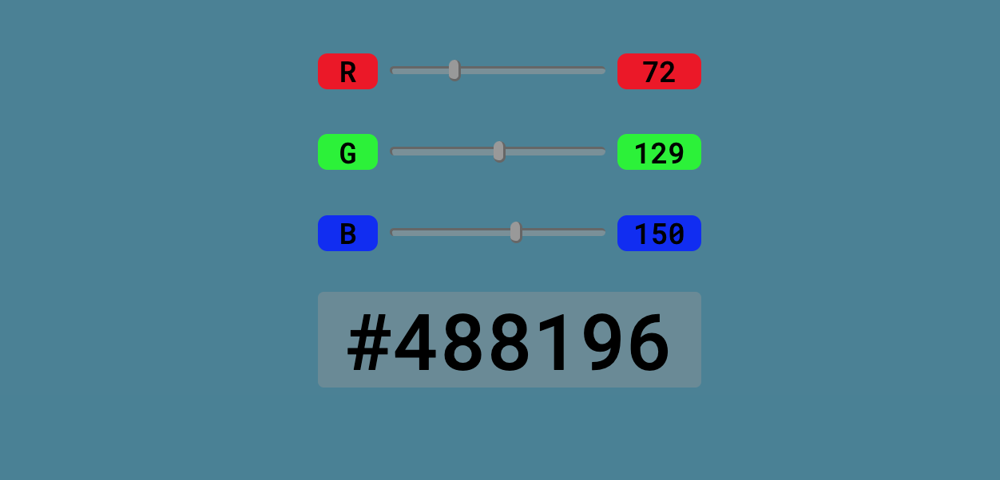
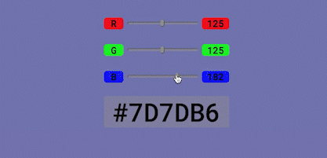

# RGB-to-HEX-Converter  
- This is a fun project I built in the early days when I just start learning DOM manipulation
- It allows users interactivly converting RGB and HEX color by controling the slider bar.
- The project was simply built with **HTML, CSS, vanilla JS**   

To see the result, you can visit [codepen](https://codepen.io/julie424/pen/popOOPV)  

